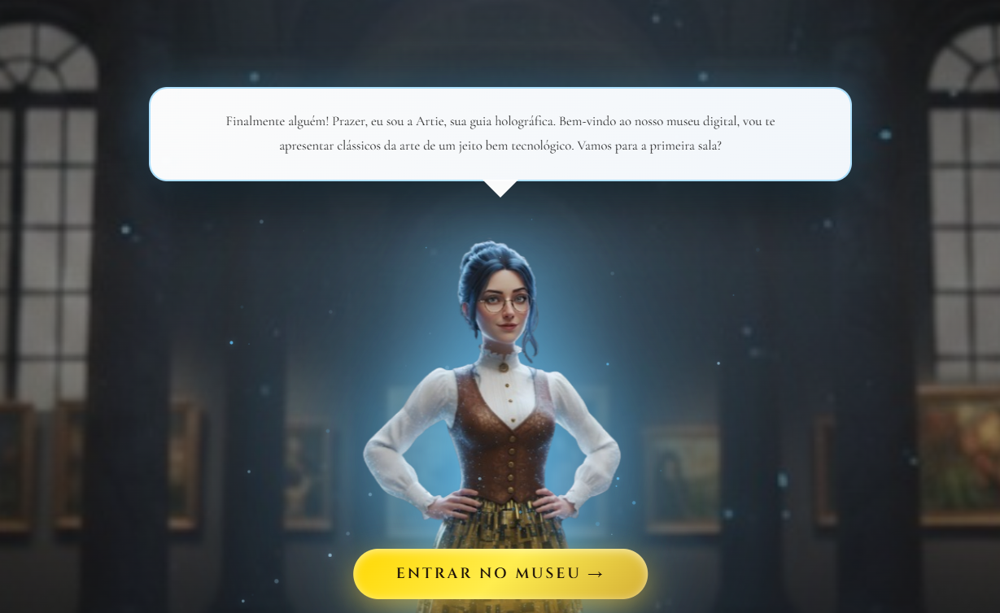
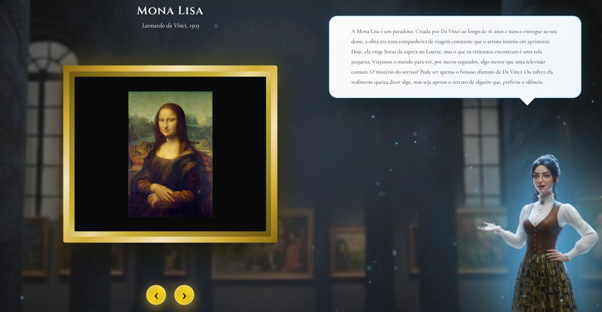

# The Virtual Museum

> *Onde clássicos da arte encontram tecnologia*



## Conceito

**The Virtual Museum** nasceu de uma provocação pessoal como
tornar arte acessível e envolvente para uma geração que cresce entre telas e interfaces digitais?

A resposta veio na forma de **Artie** uma guia holográfica que não apenas *mostra* obras de arte, mas *conversa* sobre elas. Ela tem personalidade, opinião, e traz uma camada de humanidade (paradoxalmente artificial) que transforma a experiência de contemplar arte em algo próximo de uma conversa entre amigos em um museu real.

Este projeto não é apenas um portfólio técnico. É uma declaração de que **tecnologia e cultura podem e devem coexistir de forma orgânica**.



## Por que este projeto está no meu portfólio?

### 1. **Storytelling através de código**
Não basta construir interfaces funcionais. Elas precisam *contar histórias*. Cada decisão visual aqui das partículas holográficas aos balões de fala, da animação de entrada à despedida com luzes apagando, foi pensada para criar uma **narrativa imersiva**.

### 2. **Acessibilidade cultural**
Por que não só pesquisar no Google?
Abrir uma imagem da Mona Lisa no Google resolve o problema da informação, mas não resolve o problema da experiência. Uma busca entrega pixels. O que falta e sempre faltou nas versões digitais da arte, é contexto vivo, aquela voz ao lado que diz "olha aqui" e te faz enxergar o que você não veria sozinho.
A Artie é uma tentativa de preencher esse espaço.
Este projeto é um protótipo, e assume isso sem desconforto. Mas a ideia por trás dele aponta para algo maior, museus virtuais que não são apenas galerias estáticas, guias que se adaptam a quem pergunta, obras que ganham camadas conforme você interage. A tecnologia para isso já existe o que ainda está sendo construído é a linguagem para usá-la bem, de um jeito que respeite tanto a arte quanto quem a contempla.

### 3. **Inovação na experiência do usuário**
- **Interatividade fluida**: Clique para acelerar diálogos, partículas que reagem à presença da Artie
- **Design emocional**: A entrada com porta, o fade das luzes ao final, cada transição foi calibrada para evocar a sensação de estar *realmente* visitando um espaço
- **Personalidade programada**: Artie não é apenas um chatbot. Ela tem tom, humor e cansaço

---

## Tecnologias

### **Por que escolhi cada ferramenta**

#### **HTML5 Semântico**
- Estrutura clara e acessível
- Preparado para SEO
- Base sólida para expansões futuras (como acessibilidade via leitores de tela)

#### **CSS3 Puro (sem frameworks)**
- **Controle total** sobre cada pixel
- **Performance**: Zero overhead de bibliotecas
- **Animações personalizadas**: Keyframes para partículas holográficas, transições suaves, efeitos de luz pulsante
- **Responsividade**: Uso estratégico de `vh` e `vw` para escalabilidade em qualquer dispositivo

#### **JavaScript Vanilla**
- **Sem dependências**: Carrega instantaneamente
- **Lógica clara**: Estado gerenciado manualmente (currentIndex, isTyping) para controle preciso
- **Canvas API**: Partículas holográficas renderizadas em tempo real
- **Event listeners inteligentes**: Sistema de idle timer, detecção de cliques, animação de typewriter
- **Observers**: MutationObservers para inicializar partículas no momento certo

#### **Por que NÃO usei React/Vue/Angular?**
Frameworks são poderosos, mas adicionar 100kb+ de JavaScript para um projeto que pode ser feito **perfeitamente** em 10kb de vanilla seria desperdício. 

---

### 🖼️ **11 Obras Curadas**
1. A Noite Estrelada — Van Gogh
2. Mona Lisa — Leonardo da Vinci
3. O Grito — Edvard Munch
4. A Persistência da Memória — Salvador Dalí
5. Moça com Brinco de Pérola — Johannes Vermeer
6. O Beijo — Gustav Klimt
7. Nenúfares — Claude Monet
8. A Grande Onda — Katsushika Hokusai
9. Guernica — Pablo Picasso
10. Nighthawks — Edward Hopper
11. American Gothic — Grant Wood

## Estrutura do Projeto
```
TheVirtualMuseum/
├── index.html          # Estrutura semântica
├── style.css           # Todos os estilos e animações
├── script.js           # Lógica, estados e Canvas
├── images/
│   ├── artie.png           # Artie (boas-vindas e final)
│   ├── artieexplica.png    # Artie (explicando obras)
│   ├── fachada.jpg         # Entrada do museu
│   ├── museum.jpg          # Fundo interno
│   ├── WelcomeArtie.png    # Screenshot para README
│   └── MonalisaArtie.png   # Screenshot para README
└── README.md           # Este arquivo
```

---

## Reflexões Finais

Este projeto representa minha filosofia de desenvolvimento:

**Tecnologia deve servir à experiência humana, não o contrário.**

Cada linha de código aqui foi escrita pensando em como fazer alguém *sentir* algo. Arte digital não precisa ser fria. Pode ser envolvente, provocativa e até engraçada.

Se você chegou até aqui, obrigado por visitar o museu. Espero que Artie tenha sido uma boa guia. 🎨✨

---

*"A arte é a mentira que nos permite reconhecer a verdade." Pablo Picasso*


